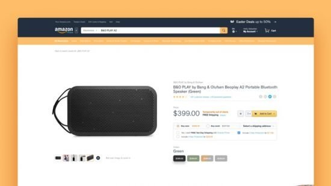

<!-- PROJECT LOGO -->
 

    

# Our Project

1. Vue.js and Node.js by building an Amazon Clone
2. Using `Vue.js` & `Nuxt.js` for Frontend and `Node.js` & `MongoDB` for Backend
3. Using `Algolia Search`
4. `Link Project` => 
5. `Link Course` => https://www.udemy.com/course/learn-how-to-build-amazon-website-using-vuejs-and-nodejs/